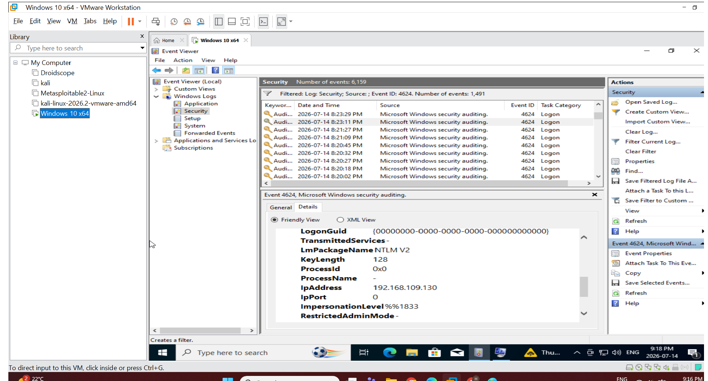
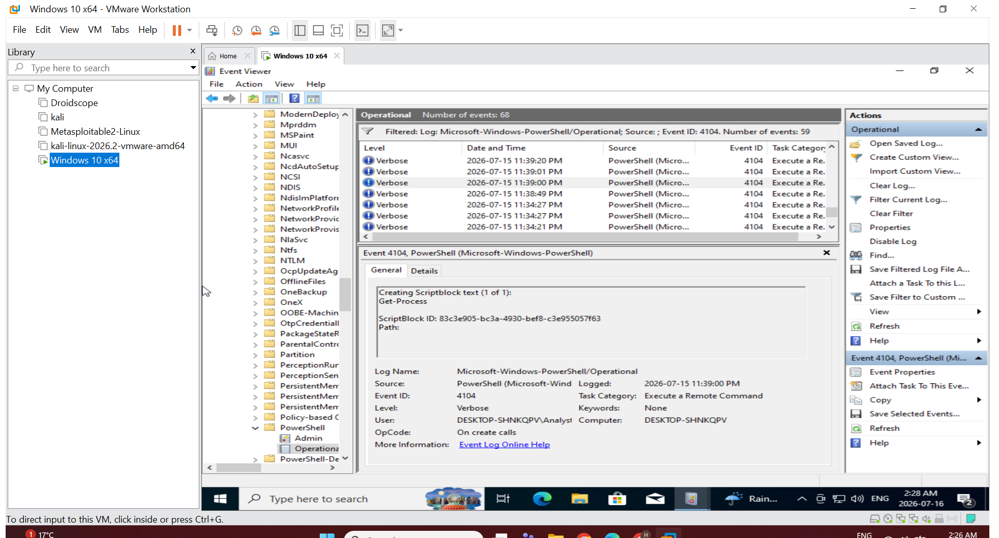
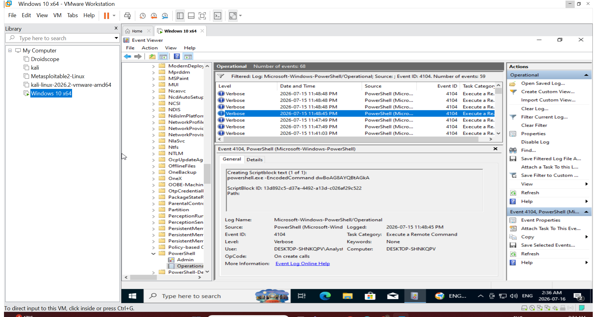
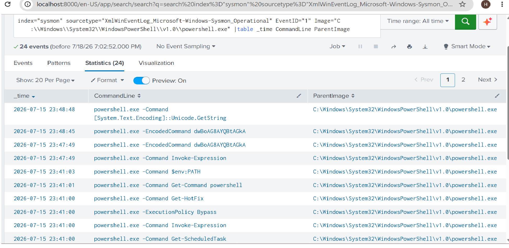
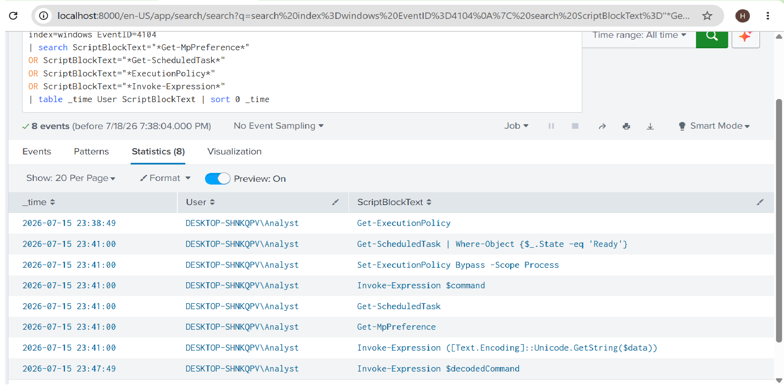
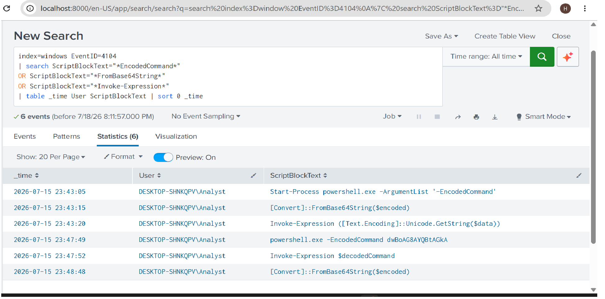
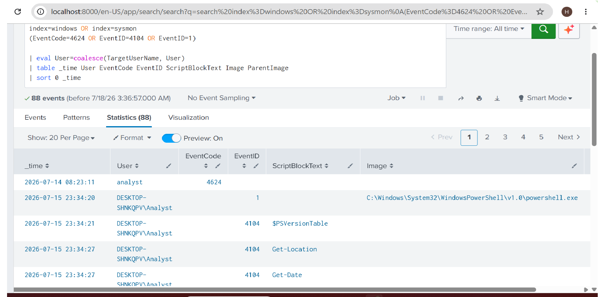
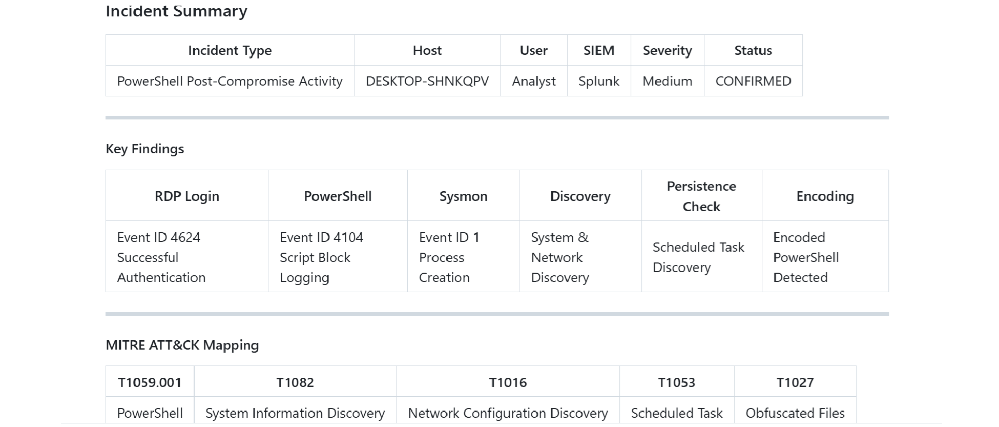

# PowerShell Post-Compromise Investigation Using Splunk

## Overview

This project demonstrates a Security Operations Center (SOC) investigation of suspicious PowerShell activity following a successful endpoint compromise.

This investigation continues from the previous RDP brute-force investigation, where successful authentication was identified.

After gaining access to the Windows endpoint, the attacker used PowerShell to perform interactive reconnaissance, enumerate system information, inspect security settings, check persistence locations, bypass PowerShell restrictions, and execute an obfuscated PowerShell command.

PowerShell Script Block Logging (Event ID 4104) and Sysmon Process Creation (Event ID 1) were collected and analyzed in Splunk to identify attacker activity.

---

# Incident Scenario

After successful authentication, a Windows workstation generated suspicious PowerShell activity.

The SOC analyst investigated:

- PowerShell execution activity
- Commands executed by the attacker
- Host enumeration activity
- User and network discovery
- Security configuration checks
- Persistence discovery
- PowerShell execution policy bypass
- Encoded PowerShell execution

---

# Environment

| **Component** | **Details** |
| -------------------- | ----------------------------- |
| SIEM | Splunk |
| Operating System | Windows |
| Hostname | DESKTOP-SHNKQPV |
| Log Sources | PowerShell Operational Logs, Sysmon |
| PowerShell Logging | Event ID 4104 |
| Sysmon Logging | Event ID 1 |
| Splunk Index | windows / sysmon |

---

# Lab Architecture

```
Windows Endpoint
DESKTOP-SHNKQPV
        |
        |
        ▼
PowerShell Script Block Logging
(Event ID 4104)

        |
        ▼

Sysmon Process Monitoring
(Event ID 1)

        |
        ▼

Splunk SIEM

        |
        ▼

PowerShell Investigation
and Detection
```

---

# Investigation Flow

The investigation followed a SOC workflow from endpoint activity detection to incident documentation.

```
Successful RDP Authentication
          |
          ▼
PowerShell Execution
          |
          ▼
Log Collection
(PowerShell 4104 + Sysmon 1)
          |
          ▼
Command Analysis
          |
          ▼
Suspicious Activity Identification
          |
          ▼
Encoded PowerShell Detection
          |
          ▼
MITRE ATT&CK Mapping
          |
          ▼
Incident Report
```

---

# Supporting Documents

```
PowerShell-Post-Compromise-Investigation
│
├── README.md
│
├── Screenshots
│   ├── 01_successful_rdp_login_event_4624.png
│   ├── 02_powershell_script_block_event_4104.png
│   ├── 03_suspicious_powershell_commands.png
│   ├── 04_sysmon_process_creation_event_1.png
│   ├── 05_splunk_powershell_activity_detection.png
│   ├── 06_splunk_encoded_command_detection.png
│   ├── 07_attack_timeline.png
│   └── 08_incident_summary.png
│
├── Evidence
│   ├── timeline.md
│   ├── iocs.md
│   └── artifacts.md
│
├── SPL-Queries
│   ├── suspicious_powershell.spl
│   ├── encoded_powershell_detection.spl
│   └── attack_timeline.spl
│
├── MITRE-ATT&CK
│   └── attack_mapping.md
│
└── Incident-Report
    └── incident_report.md

```

---

# Data Sources

## PowerShell Operational Logs

**Sourcetype**

```
WinEventLog:Microsoft-Windows-PowerShell/Operational
```

Primary Event:

| **Event ID** | **Description** |
|---|---|
| 4104 | PowerShell Script Block Logging |

Event ID 4104 records the actual PowerShell commands executed by the user.

Examples:

```
Get-MpPreference

Get-ScheduledTask

Invoke-Expression

Set-ExecutionPolicy Bypass
```

---

## Sysmon Logs

**Sourcetype**

```
XmlWinEventLog:Microsoft-Windows-Sysmon/Operational
```

Primary Event:

| **Event ID** | **Description** |
|---|---|
| 1 | Process Creation |

Sysmon Event ID 1 was used to identify:

- PowerShell execution
- Parent process
- Executed image
- User context

Example:

```
ParentImage:
explorer.exe

Image:
powershell.exe
```

---

# Investigation Summary

The investigation identified suspicious PowerShell activity on the Windows endpoint.

Observed attacker behavior included:

- System information discovery
- User enumeration
- Network discovery
- Process and service enumeration
- Windows Defender configuration checks
- Persistence mechanism checks
- Execution policy bypass
- Encoded PowerShell execution

Detailed command analysis is available in:

```
Incident-Report/incident_report.md
```

---

# Key Findings

## PowerShell Reconnaissance Activity

The attacker performed host discovery using commands including:

```
$PSVersionTable

Get-Date

Get-Location

hostname

whoami

Get-ComputerInfo
```

These commands provided information about the compromised system and user context.

---

## Security and Persistence Discovery

The attacker queried security settings and persistence locations:

```
Get-MpPreference

Get-ScheduledTask

HKLM:\Software\Microsoft\Windows\CurrentVersion\Run
```

This activity may indicate reconnaissance before additional attacker actions.

---

## Defense Evasion Activity

The attacker attempted to bypass PowerShell restrictions:

```
Set-ExecutionPolicy Bypass -Scope Process
```

Execution policy bypass is commonly observed during malicious PowerShell activity.

---

## Encoded PowerShell Execution

The attacker executed an obfuscated PowerShell command:

```
powershell.exe -EncodedCommand dwBoAG8AYQBtAGkA
```

The command used Base64 decoding techniques:

```
FromBase64String()

Unicode.GetString()

Invoke-Expression
```

Encoded PowerShell is commonly associated with command obfuscation and defense evasion.

---

# Splunk Investigation

## Detect Suspicious PowerShell Commands

```
index=windows EventID=4104
| search ScriptBlockText="*Get-MpPreference*"
OR ScriptBlockText="*Get-ScheduledTask*"
OR ScriptBlockText="*ExecutionPolicy*"
OR ScriptBlockText="*Invoke-Expression*"
| table _time User ScriptBlockText
```

---

## Detect Encoded PowerShell

```
index=windows EventID=4104
| search ScriptBlockText="*EncodedCommand*"
OR ScriptBlockText="*FromBase64String*"
OR ScriptBlockText="*Invoke-Expression*"
| table _time User ScriptBlockText
```

---

## PowerShell Attack Timeline

```
index=windows OR index=sysmon
(EventCode=4624 OR EventID=4104 OR EventID=1)
| table _time User EventCode EventID ScriptBlockText Image ParentImage
| sort 0 _time
```

---

# Investigation Timeline

| **Time** | **Event ID** | **Description** |
|---|---|---|
| 08:23:11 | 4624 | Successful RDP authentication (previous investigation context) |
| 08:23:xx | 1 | PowerShell process creation |
| 08:23 - 08:48 | 4104 | PowerShell commands captured |
| 08:47:xx | 1 / 4104 | Encoded PowerShell execution detected |

---

# MITRE ATT&CK Mapping

| **Activity** | **Technique** | **ID** |
|---|---|---|
| PowerShell Execution | Command and Scripting Interpreter: PowerShell | T1059.001 |
| System Discovery | System Information Discovery | T1082 |
| Network Discovery | System Network Configuration Discovery | T1016 |
| PowerShell Obfuscation | Obfuscated Files or Information | T1027 |
| Persistence Discovery | Scheduled Task Discovery | T1053 |

---

# Evidence Collected

The investigation contains:

- Successful RDP authentication context
- PowerShell Event ID 4104 evidence
- Suspicious PowerShell command analysis
- Sysmon Process Creation evidence
- Splunk PowerShell detection queries
- Encoded PowerShell detection
- Attack timeline reconstruction
- Incident summary
- MITRE ATT&CK mapping
- Investigation documentation

Supporting screenshots and investigation artifacts are available in the `Screenshots/` and `Evidence/` directories.

---

# Screenshots

## Successful RDP Authentication Context



---

## PowerShell Script Block Logging Event ID 4104



---

## Suspicious PowerShell Commands



---

## Sysmon Process Creation Event ID 1



---

## Splunk PowerShell Activity Detection



---

## Encoded PowerShell Detection



---

## Attack Timeline



---

## Incident Summary



---

# Conclusion

Analysis of PowerShell Script Block Logging and Sysmon telemetry identified suspicious post-compromise activity on the Windows endpoint.

The investigation confirmed PowerShell-based reconnaissance, security configuration checks, execution policy bypass attempts, and encoded PowerShell execution.

Splunk enabled the SOC analyst to correlate endpoint events, identify attacker behavior, and document the incident response process.
